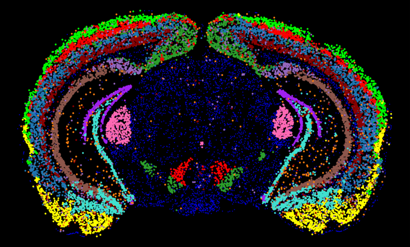

# SpatialBrain



SpatialBrain is a web portal for exploring mouse midbrain gene expression from the Wade-Martins Laboratory of Molecular Neurodegeneration. It covers spatial transcriptomics and TRAP assays, focused on dopaminergic neurons of the substantia nigra and ventral tegmental area, including ageing.

The live portal is at [spatialbrain.org](https://spatialbrain.org).

## The analyses

The spatial transcriptomics analyses cover cell type markers, SN/VTA markers, and cell type numbers with age. The TRAP analyses cover enrichment in dopaminergic neurons, ageing, and alternative splicing. A Gene Query tab searches across all analyses, and the Download Data tab provides the result tables as a ZIP with links to the raw data.

## The paper

Kilfeather P, Khoo JH, Wade-Martins R. Single-cell spatial transcriptomic and translatomic profiling of dopaminergic neurons in health, aging, and disease. *Cell Rep.* 2024 Mar 26;43(3):113784. doi: 10.1016/j.celrep.2024.113784. [PMID: 38386560](https://pubmed.ncbi.nlm.nih.gov/38386560/).

## The data

The data behind the portal are in this repository under `app/input/`. The analysis tables can be downloaded from the portal's Download Data tab.

## Run it locally

With Docker, from the repository root:

```
docker build -t spatialbrain .
docker run -p 3838:3838 spatialbrain
```

Then open http://localhost:3838. The Dockerfile lists the packages the app needs, so it is the source of truth for dependencies.

Without Docker, install R 4.4.1 and the packages listed in the Dockerfile, then run the app from the repository root:

```
R -e "shiny::runApp('app')"
```

## Health check

`check-up.sh` fetches the public URL and sends a notification if the portal stops responding.

## Repository layout

- `app/` the Shiny app (app.R plus the modules in R/)
- `app/input/` the data behind the analyses
- `Dockerfile` and `shiny-server.conf` for deployment
- `check-up.sh` health check for the live portal
